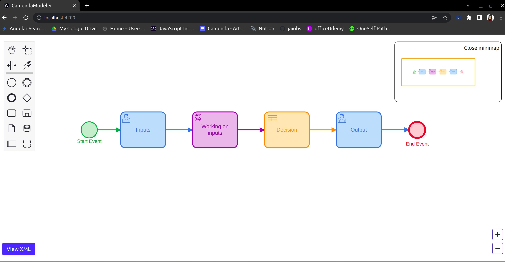
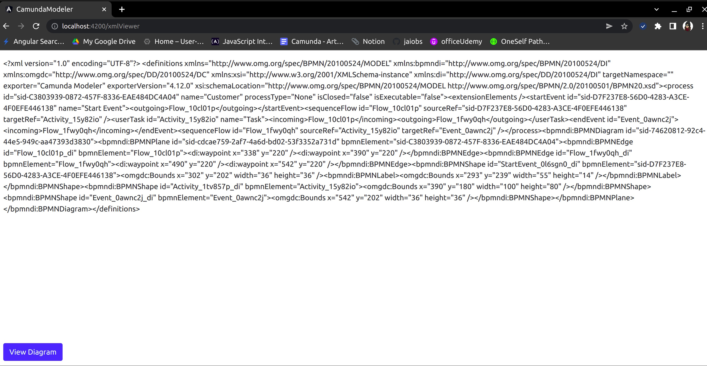

# Camunda Modeler in Angular

The project includes the following features,
* A page to edit BPMN
* A page to view the XML
* Zoom in and out
* Minimap to locate the diagram in the canva
* color picker for the components

## Install the following packages

`npm i bpmn-js`
`npm i diagram-js-minimap`
`npm i bpmn-js-color-picker`

#
## Sample Output images

BPMN diagram editor

#

BPMN XML viewer

